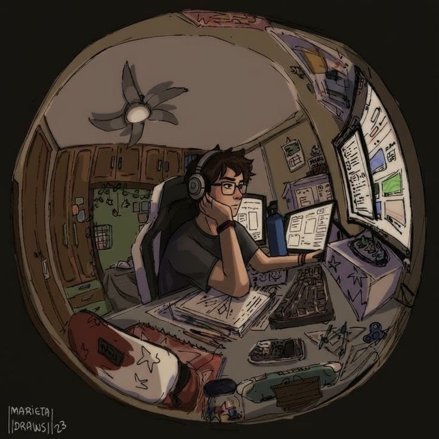

  

 

<h2>👨‍💻 About Me</h2>

<table>
<tr>

<td width="60%" align="left" style="vertical-align: top; padding-right: 20px;">

I'm <b style="color:#41F7B3;">Rishabh</b> — a developer focused on building systems that go beyond just working.

  

I enjoy creating <b>real-world, production-ready applications</b> by combining <b>full-stack development</b> with <b>machine learning</b>.  
My goal is to design solutions that are practical, scalable, and actually useful.

  

Over time, I've developed a strong interest in understanding how systems behave — from user interfaces to data pipelines — and turning that understanding into clean, efficient implementations.

</td>

<td width="40%" align="center">

</td>

</tr>
</table>

